[English](./README.en.md) · [Website](https://skvet.lei6393.com) · [GitHub](https://github.com/SuperMarioYL/skvet)

<picture>
  <source media="(max-width: 600px) and (prefers-color-scheme: dark)" srcset="./assets/presentation/hero-mobile-dark.svg">
  <source media="(max-width: 600px)" srcset="./assets/presentation/hero-mobile-light.svg">
  <source media="(prefers-color-scheme: dark)" srcset="./assets/presentation/hero-dark.svg">
  
</picture>

# skvet

**让 Skill 运行前，先检查它的行为**

skvet 扫描 Agent Skill 目录中的可执行脚本、生命周期钩子和外连模式，给出对应源码证据，并按可配置阈值返回风险结果。

## 为什么需要它

Skill 不只包含 Markdown 指令，安装脚本和钩子也可能运行命令。安装前可先查看报告，定位每项发现对应的文件、行号和规则。

- **查看具体证据** — 每项发现包含规则、严重程度、行为类型和源码位置。
- **无需执行被扫描内容** — 规则检查读入内存的文件，本地扫描不会运行包内钩子。
- **设置 CI 阈值** — 通过 --fail-on 选择哪些风险等级返回退出码 2。

## 架构

<picture>
  <source media="(max-width: 600px) and (prefers-color-scheme: dark)" srcset="./assets/presentation/architecture-mobile-dark.svg">
  <source media="(max-width: 600px)" srcset="./assets/presentation/architecture-mobile-light.svg">
  <source media="(prefers-color-scheme: dark)" srcset="./assets/presentation/architecture-dark.svg">
  
</picture>

fetch 层接受本地目录或浅克隆 GitHub 仓库。发现阶段识别 SKILL.md 及支持的插件、钩子布局。shell、hook、network 规则生成发现项，评分模块排序并确定总体等级，文本和 JSON 输出共享同一结果。

| 组件 | 职责 |
| --- | --- |
| `Target` | local path or GitHub ref |
| `Discovery` | skill and hook layouts |
| `Rules` | shell / hooks / network |
| `Score + report` | findings and exit threshold |

## 安装与快速上手

需要 Go 1.24+；双样本演示使用 Python 3。

```bash
git clone https://github.com/SuperMarioYL/skvet.git
cd skvet
go build -o bin/skvet .
```

示例扫描仓库内的正常和恶意行为样本，报告实际风险等级和退出码。包含可疑行为的样本脚本只被读取，不会被执行。

```bash
python3 examples/presentation_demo.py
```

## 实际运行示例

<picture>
  <source media="(max-width: 600px) and (prefers-color-scheme: dark)" srcset="./assets/presentation/process-mobile-dark.svg">
  <source media="(max-width: 600px)" srcset="./assets/presentation/process-mobile-light.svg">
  <source media="(prefers-color-scheme: dark)" srcset="./assets/presentation/process-dark.svg">
  
</picture>

Bundled fixtures demonstrate both passing and blocking CI outcomes without running their scripts.

```text
benign-skill: overall=LOW exit=0
  score=0 rules=
malicious-skill: overall=HIGH exit=2
  score=100 rules=SK-HOOK-001,SK-NET-001,SK-SHELL-001,SK-SHELL-002
Scope: static fixture analysis; no hooks, scripts or network calls executed.
```

完整命令与输出保存在 [docs/demo-results.json](./docs/demo-results.json). 输入和复现代码均随仓提供。


保留已有录制供参考；上方文字示例给出当前可复现的操作。

## 用法

scan 接受一个目标。本地路径可离线使用；github.com/owner/repo 目标需要 Git 和网络。--json 保留详细证据，--fail-on none 输出报告而不因风险等级返回失败。上方最后一条命令会按预期返回 2。

```bash
./bin/skvet scan ./testdata/fixtures/benign-skill
./bin/skvet scan ./testdata/fixtures/malicious-skill --json --fail-on none
./bin/skvet scan ./testdata/fixtures/malicious-skill --fail-on medium
```

## 配置

--fail-on 可选 none、low、medium、high，默认 high。分数上限为 100，单项 high 严重度发现也会直接产生 HIGH。未发现任何 Skill 的空目标报告 NONE。规则检查 shell、支持的钩子清单和外连模式；应关注源码证据，不应把分数当作概率。

## 集成与职责分工

<picture>
  <source media="(max-width: 600px) and (prefers-color-scheme: dark)" srcset="./assets/presentation/integrations-mobile-dark.svg">
  <source media="(max-width: 600px)" srcset="./assets/presentation/integrations-mobile-light.svg">
  <source media="(prefers-color-scheme: dark)" srcset="./assets/presentation/integrations-dark.svg">
  
</picture>

skvet 分析 Skill 包自身。依赖漏洞检测、运行时沙箱和签名校验分别处理安装风险的其他部分。可以将发现项用于人工审查，通过 --json 向其他工具传递完整结果。

| 路径 | 已实现职责 |
| --- | --- |
| Local directory | scan an existing checkout |
| GitHub reference | temporary shallow clone |
| Text report | file and line evidence |
| JSON report | automation and CI gates |

## 限制与后续方向

- 静态模式匹配可能漏检，也可能标记合法命令。LOW 不代表安全保证。
- 远程扫描会下载仓库，但不会安装其中的 Skill。
- 记录结果仅覆盖随仓样本，不代表任意运行时行为或完整安全审计。

已实现本地和远程目标、源码证据、文本与 JSON 报告以及可配置退出阈值。后续方向包括文件系统和凭据读取模式、更多清单布局及专用 GitHub Action。尚未实现托管面板或自动隔离。

## 许可与贡献

许可见 [LICENSE](./LICENSE). 反馈问题时请提供最小输入、执行命令和实际输出。
